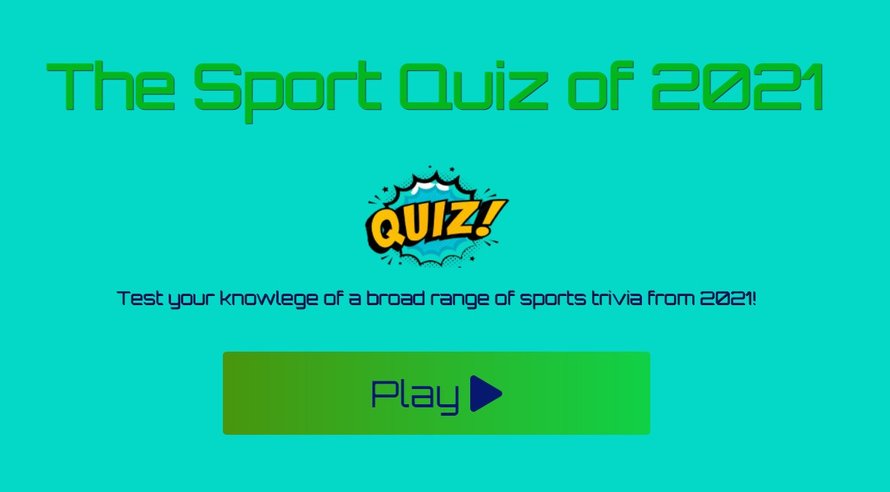

# 2021 Sport Quiz

2021 Sport Quiz is a quiz designed to test the users' knowledge of major sporting events throughout the year of 2021.

# Features
- __Progress Bar__
    - The progress bar will fill up as you complete each question. The idea for how to impliment this was taken from this youtube video:
    https://www.youtube.com/watch?v=basf1lH1H-E&ab_channel=WebDevSimplified with my own modifications.

       

- __Score__
    - The score increases as you get an answer correct or remains the same if you are incorrect.
    This score is then stored and called apon in the final page where you are displayed with your final score
    

- __Style change based on answer__
    - The colour of the choice you select will change based on your answer. If you are correct the choice will be highlighted green, and if you are incorrect it will highlight red.
    - The score will also be increased if you are correct.
    - The progress bar will increase in width whether you are correct or incorrect
        
 
## Usage
The quiz was designed with an intuitive design in mind.
The user simply clicks on the answer they deem to be correct and the app will display green for a correct answer and red for incorrect.
A correct answer will also give them 10 points.
Reguardless of correct or incorrect answer the progress bar will increase as you move on to the next question.
Once the user reaches the defined max questions (10 as it stands), the app will return the user to the finish page (finish.html).
Here they can see their score and are asked if they would like to play again or return to the home page.

## Features to impliment in the future
 - A scoreboard of stored scores with a username display