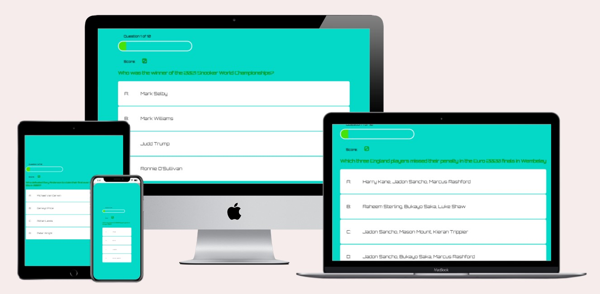
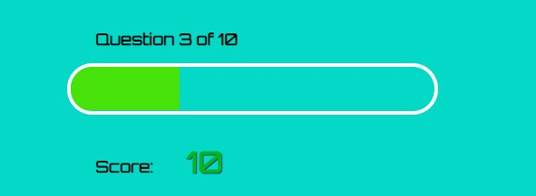
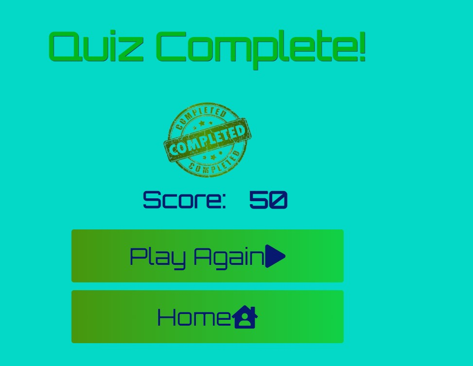
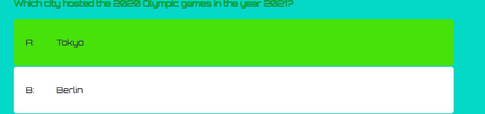
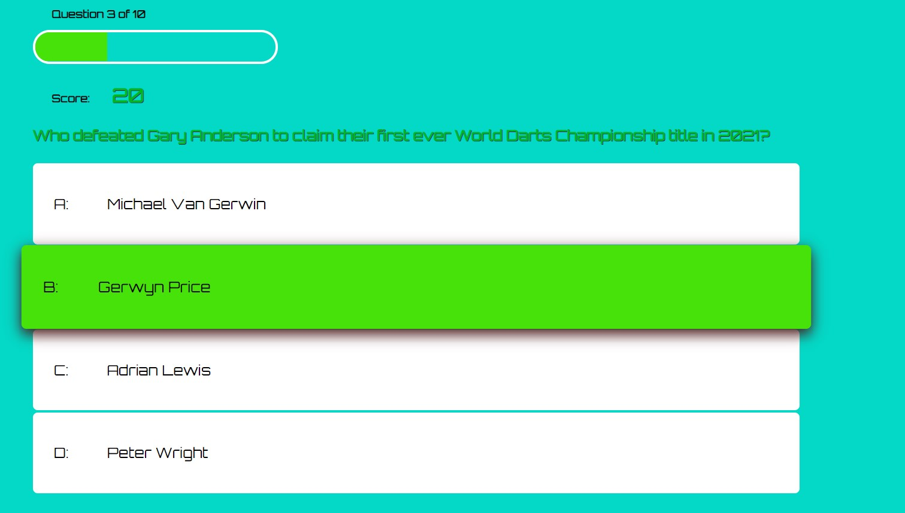

# 2021 Sport Quiz

2021 Sport Quiz is a quiz designed to test the users' knowledge of major sporting events throughout the year of 2021.

# Features
- __Progress Bar__
    - The progress bar will fill up as you complete each question. The idea for how to impliment this was taken from [this youtube video:](https://www.youtube.com/watch?v=basf1lH1H-E&ab_channel=WebDevSimplified) with my own modifications.

       

- __Score__
    - The score increases as you get an answer correct or remains the same if you are incorrect.
    This score is then stored and called apon in the final page where you are displayed with your final score
    

- __Style change based on answer__
    - The colour of the choice you select will change based on your answer. If you are correct the choice will be highlighted green, and if you are incorrect it will highlight red.
    - The score will also be increased if you are correct.
    - The progress bar will increase in width whether you are correct or incorrect
        
 
## Usage
The quiz was designed with an intuitive design in mind.
The user simply clicks on the answer they deem to be correct and the app will display green for a correct answer and red for incorrect.
A correct answer will also give them 10 points.
Reguardless of correct or incorrect answer the progress bar will increase as you move on to the next question.
Once the user reaches the defined max questions (10 as it stands), the app will return the user to the finish page (finish.html).
Here they can see their score and are asked if they would like to play again or return to the home page.

## Features to impliment in the future
 - A scoreboard of stored scores with a username display

 # Testing

## User Testing

- I tested the quiz after each change and had to make some changes to the code to resolve some bugs.
    The first problems that arose were due to simple syntax errors when trying to manipulate the DOM. Creating const variables of a variable that already existed caused an error in the javascript.
- Some misplaced brackets caused the getNewQuestion function not to co-operate initially.
- The incrimentScore funtion didn't work initially. This was created to increase your score by manipulating the scoreText variable's inner text. 
    The reason this didn't work initially was a syntax error, using a comma instead of a semi-colon (scoreText,innerText > scoreText.innerText )
-   I had an indexing issue at the end of the quiz, we weren't reaching the finish.html page. This was simply due to a file pathing mistake. I added an unnessecary '/' in the file path : '/finished.html'.
-   The rest of my testing was based on readability and accesibility on mobile. There are a few commits explaining my changes for readibility in the CSS.

 ## Validator Testing

 - HTML 
    - An error was found at line 22 in the game.html page where there was no space between attributes. This was corrected and re-committed. 

- CSS
    - An error occured when testing with the official Jigsaw validator, font-weight was set to 2000 and this attribute cannot be higher than 1000. This issue was fixed then re-committed. After this fix, no errors were found.
- JavaScript
    - JSHint pointed out some missing semi-colons and a few un-used variables that I rectified in a commit to the repository.

# Deployment
-   The site was deployed using GitHub and GitHub pages.
    - Each change was documented with a commit to GitHub and a description was given on each change.
    - The site was hosted on GitHub pages.
        - The live link for the GitHub pages site is as follows - https://liamh97.github.io/Quizz-App-Project/

# Credits
- The Progress Bar
    - The idea for how to impliment this was taken from [this youtube video:](https://www.youtube.com/watch?v=basf1lH1H-E&ab_channel=WebDevSimplified) with my own modifications.
## Content
-   The content for the questions and answers was taken from my own knowlege of major sporting events this year
- The icons in the buttons were taken from [Font Awesome ](https://fontawesome.com/)
## Media
-  The images used in the home page and the final page were taken from [This Open Source site](https://stock.adobe.com/)

## Code 
 - The code for localStorage to store the score and re-display your final score in the final page was taken from [This guide ](https://blog.logrocket.com/localstorage-javascript-complete-guide/)

